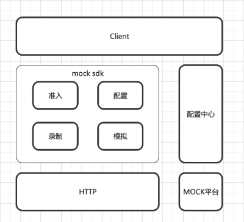

# mock

## Project structure diagram
<p align="left">
  
</p>

## The directory structure
```
｜── config             // 配置目录
｜ ├── check.go         // 配置检测，检测是否执行mock/record
｜ ├── env.go           // 环境配置
｜ └── sps_config.go    // spex配置
｜── constant
｜ └── constant.go      // 宏定义集合
｜── docs               // 资源文件
｜── logger
｜ └── logger.go        // 日志操作
｜── model              
｜ ├── config.go        // 配置结构体定义
｜ ├── mock.go          // mock结构定义
｜ └── record.go        // 录制结构定义
｜── utils
｜ ├── file.go          // 文件操作
｜ └── http.go          // http操作
｜── recorder.go        // 录制器，执行录制逻辑
｜── mocker.go          // 模拟器，执行mock逻辑
｜── mock.go            // mock对外inteface
｜── README.md
```

## Basic Usage


## Version

